# joust

A desktop SQL workbench for [LanceDB](https://lancedb.com), built with
[iced](https://iced.rs): a database explorer on the left, a SQL editor on top,
and results below with a data grid, a column profiler, a media gallery, a
query-plan visualiser and charts.

(A *lance* is what you *joust* with.)

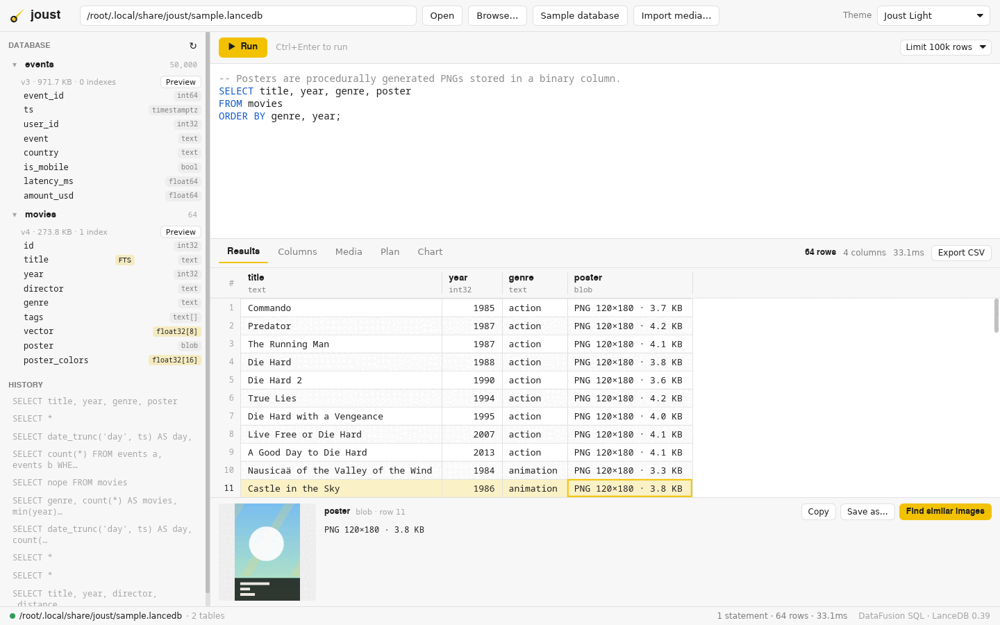

## Features

- **SQL over LanceDB.** Every table in the database is registered with
  [DataFusion](https://datafusion.apache.org), so joins, aggregates, window
  functions, CTEs, `EXPLAIN`, `information_schema` and `INSERT INTO` all work.
  `CREATE [OR REPLACE] TABLE … AS SELECT` materialises a real Lance table and
  `DROP TABLE` drops one.
- **Vector and full-text search from SQL.**
  - `vector_search('table', 'column', '[0.1, 0.2, …]', k [, 'l2'|'cosine'|'dot'])`
    runs a LanceDB nearest-neighbour query and adds a `_distance` column.
  - `fts('table', '{"match": {"column": "title", "terms": "die hard"}}')` runs a
    full-text query (needs an FTS index; there is a one-click button for it).
  - Select any vector cell in the results and press **Find similar** to search
    for its neighbours.
- **Database explorer.** Tables with row counts, version, size and indexes;
  expand to see columns and types, click a column to insert it into the editor,
  one-click **Preview**, and (on hover) buttons to build a scalar, vector or
  full-text index on a column.
- **SQL editor** with theme-aware syntax highlighting. `Ctrl+Enter` (or `F5`)
  runs the whole editor, or only the selection; multiple statements run in
  order and the last result set is shown. Long queries can be cancelled with
  `Esc` or the Cancel button, which stops the query itself, not just the wait.
  Queries run on their own thread pool (leaving a core free), so the UI stays
  responsive while DataFusion is busy. Query history is kept in the sidebar.
- **Results grid.** Virtualised canvas grid that stays smooth with hundreds of
  thousands of rows: click headers to sort (asc → desc → off), drag header
  edges to resize, click or use the arrow keys / PageUp / PageDown to move the
  selection, `Ctrl+C` to copy a value. A cell inspector shows the full value.
  Results can be exported to CSV.
- **Column explorer.** Per-column profile cards: null rate, distinct count,
  histograms for numbers, timestamps and vector norms, top values for text, and
  format breakdowns, byte sizes and image dimensions for media columns.
- **Multimodal data.** LanceDB tables often hold images, audio, video or PDFs
  next to their embeddings; joust treats them as first-class values:
  - Binary cells are recognised by their bytes and described instead of
    hex-dumped (`PNG 120×180 · 3.8 KB`, `MP4 1280×720 · H.264 · 0:12 · 4 MB`,
    `WAV audio · PCM · 0:03 · 530 KB`). Text columns holding paths to local
    image or video files are recognised too.
  - The cell inspector previews images, and **Save as…** writes any binary
    value to a file. **Open** hands any media value to the system's default
    app (a video or audio player, a PDF viewer).
  - A **Media** tab shows a thumbnail gallery whenever a result has an image
    or video column (thumbnails are decoded off the UI thread).
  - **Video:** tiles show a poster frame and a `▶ 0:04` duration badge; the
    inspector shows an 8-frame filmstrip, frame rate and codecs, and **Play**
    flips through the filmstrip in (roughly) real time. That preview has no
    audio — **Open** plays the real thing in your player.
  - **Find similar images / videos** computes the colour vector of the
    selected picture (a video's poster frame) and runs `vector_search` against
    the table's colour-vector column.
  - SQL functions: `media_type(bytes)` (MIME type), `image_width(bytes)`,
    `image_height(bytes)`, `byte_length(bytes)`, and for images *and* videos
    `media_width(bytes)` / `media_height(bytes)`, plus `media_duration(bytes)`
    (seconds, video and audio) and `media_codec(bytes)` (e.g. `H.264`, `VP9`,
    `AAC`).
  - **Import media…** loads a folder (recursively) of images, audio, video and
    PDFs into a new table with `path`, `file_name`, `kind`, `mime`,
    `size_bytes`, `width`, `height`, `duration_s`, `codec`, `modified`, a
    256px PNG `thumbnail` (a poster frame for videos), a 16-d `color_vector`
    and the original bytes in `data`. Files over 256 MB are imported by
    reference (`data` is NULL; `path` still opens them). Browse the
    `thumbnail` column; `SELECT *` also loads every original.

  Video metadata (MP4/MOV/M4A, WebM/Matroska, WAV) is parsed in pure Rust, so
  durations, sizes and codecs work everywhere. Decoding **frames** needs
  [ffmpeg](https://ffmpeg.org) on your `PATH` (or `JOUST_FFMPEG=/path/to/ffmpeg`);
  it is called as an external program, never linked. Without it, videos show
  a placeholder tile but everything else works.

  The colour vector is a hue/lightness histogram, so "similar" means similar
  palette, not similar content. For semantic search, store embeddings from a
  model of your choice in a vector column and use `vector_search` on it.
- **Query plan visualiser.** After every query the executed physical plan is
  drawn as a tree: each operator shows its parameters, rows produced and
  compute time, with a bar for its share of the slowest operator, and edges are
  labelled with the rows flowing between operators. Hover for every metric;
  drag to pan, `Ctrl`+scroll to zoom. Text views of the physical (with metrics)
  and logical plans are one click away.
- **Charts.** Bar, line, scatter and histogram views of the current result
  with sensible defaults (time column → line chart, category → bar chart),
  hover tooltips and clean axes.
- **Nine themes:** Joust Light, Joust Dark, Lance Midnight, Nord, Dracula,
  Solarized Light, Gruvbox Dark, Tokyo Night and Catppuccin Mocha (see
  [below](#themes)). Each has its own syntax colours. The theme, recent databases, row limit and history
  persist in `~/.config/joust/settings.json` (platform equivalent elsewhere).
- **Sample database.** One click creates `movies` (real titles, years and
  directors with a *synthetic* 8-dimensional genre/era embedding, an FTS index
  on `title`, and a procedurally generated `poster` PNG per film with its
  `poster_colors` vector; the posters are abstract genre-palette art, not the
  real posters), `events` (50,000 generated analytics events) and, when
  ffmpeg is installed, `trailers`: one 4-second generated MP4 per genre
  (animated gradients in the genre's colours, not real trailers) with a
  `clip_colors` vector.

## Screenshots

| Media gallery (Joust Dark) | Video with filmstrip (Lance Midnight) |
|---|---|
| 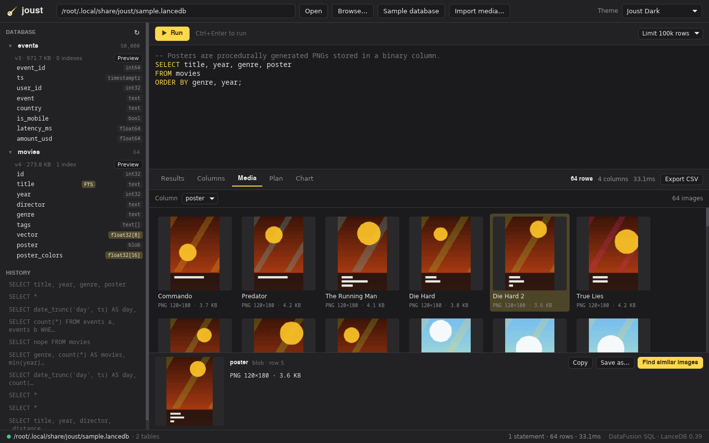 | 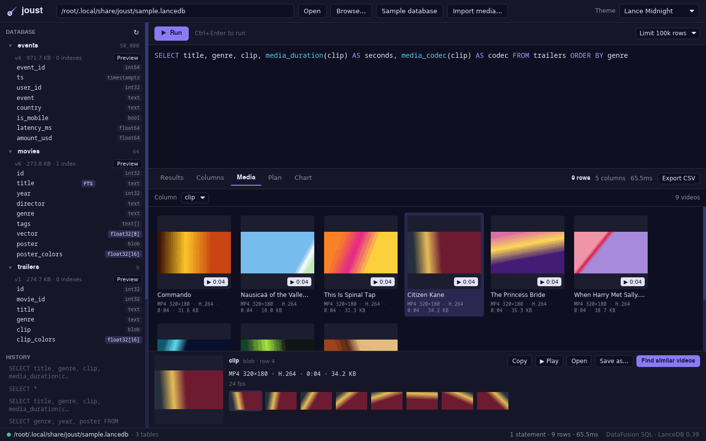 |

| Query plan (Tokyo Night) | Chart (Lance Midnight) |
|---|---|
| 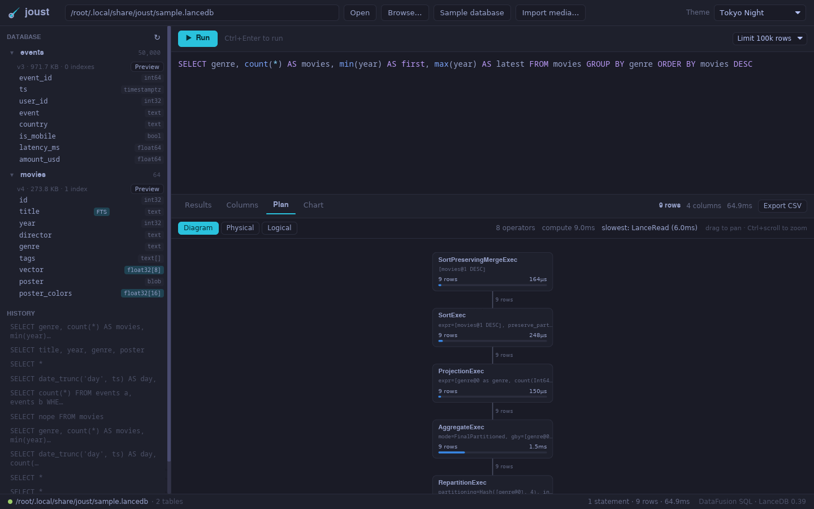 | 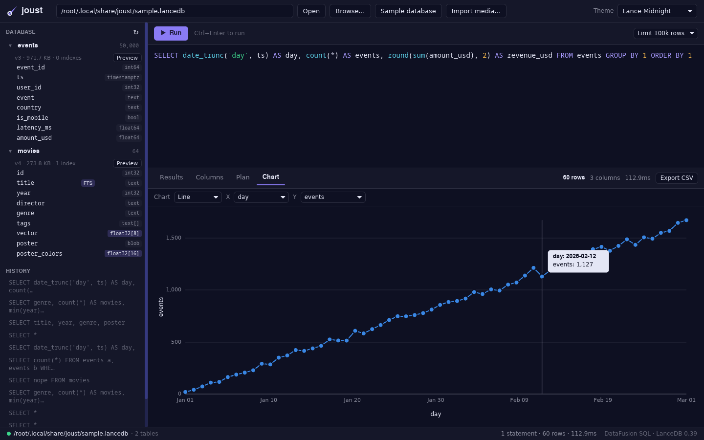 |

| Column explorer (Nord) |
|---|
| 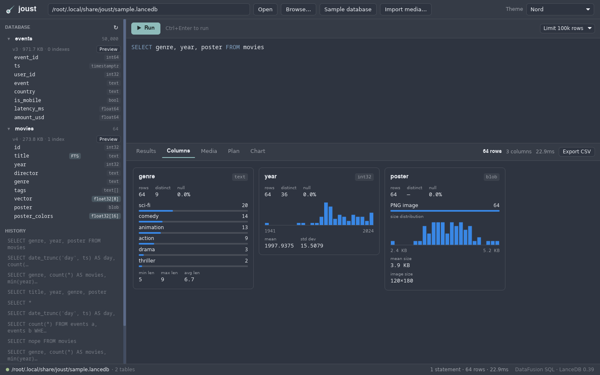 |

### Themes

The same view in every theme:

| Joust Light | Joust Dark | Lance Midnight |
|---|---|---|
|  | 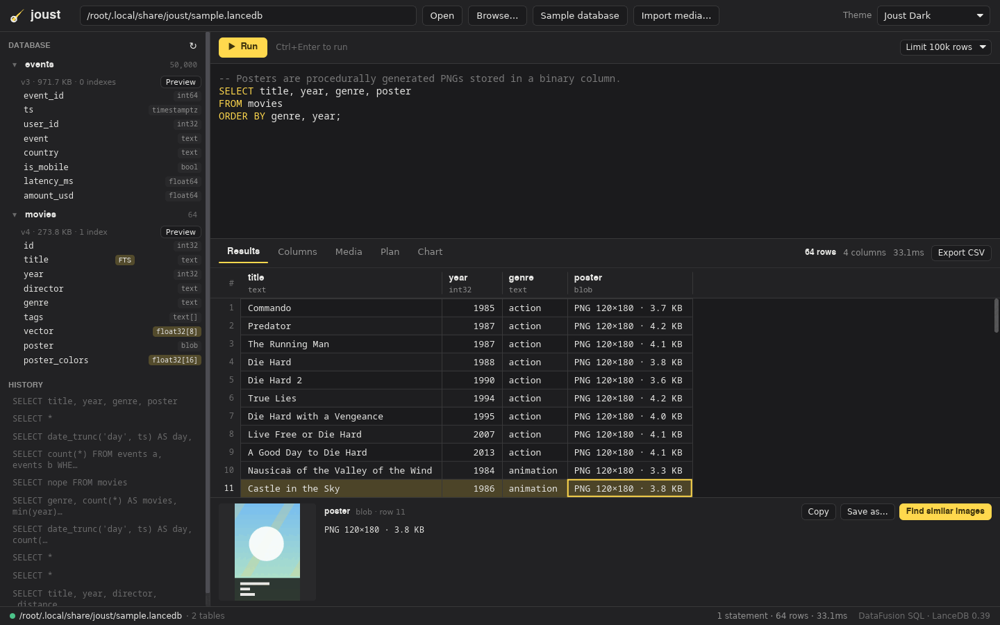 | 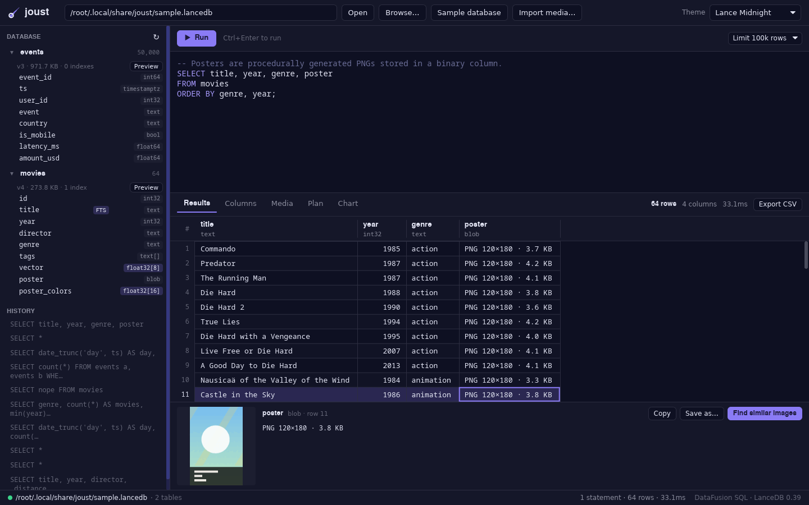 |
| **Nord** | **Dracula** | **Solarized Light** |
| 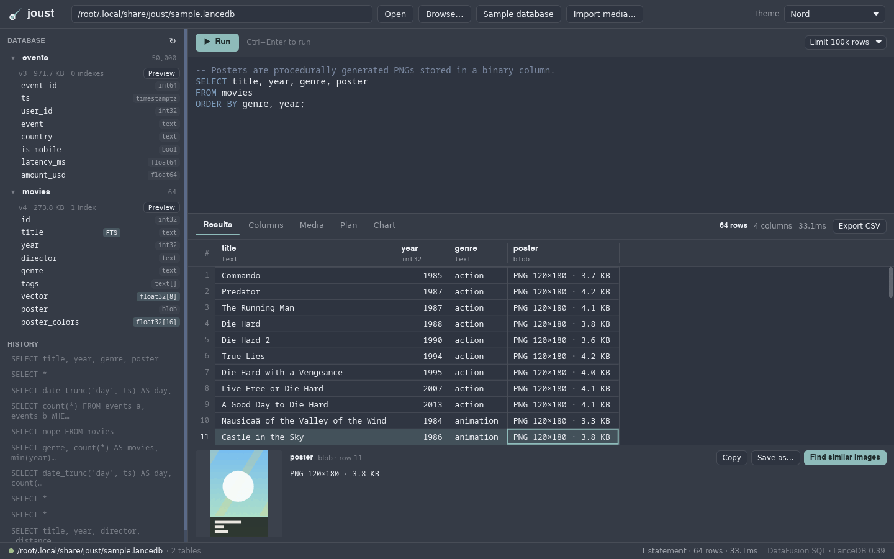 | 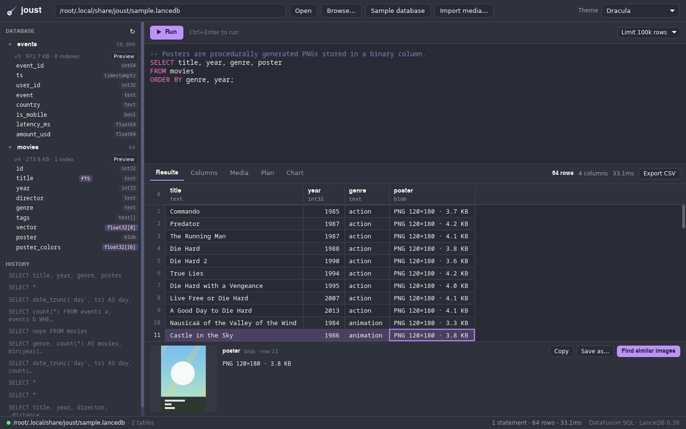 | 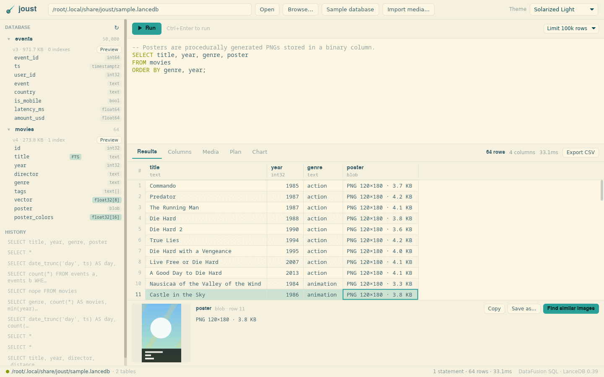 |
| **Gruvbox Dark** | **Tokyo Night** | **Catppuccin Mocha** |
| 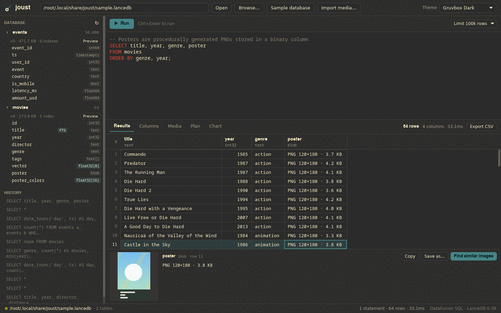 | 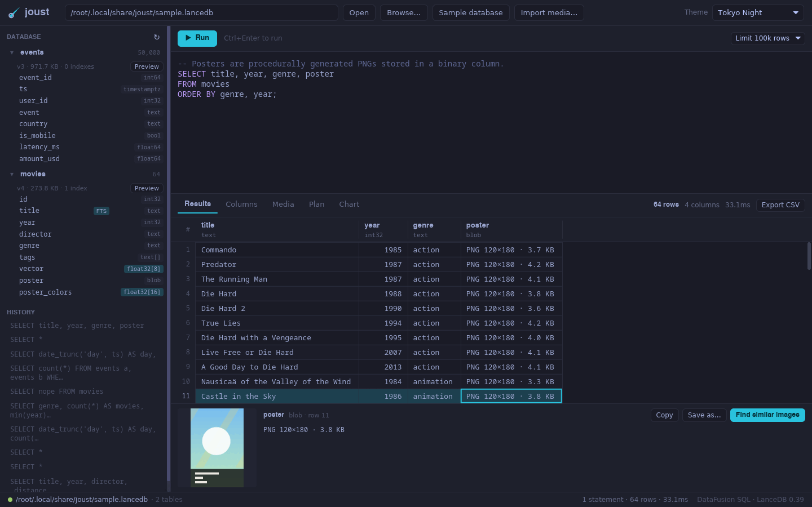 | 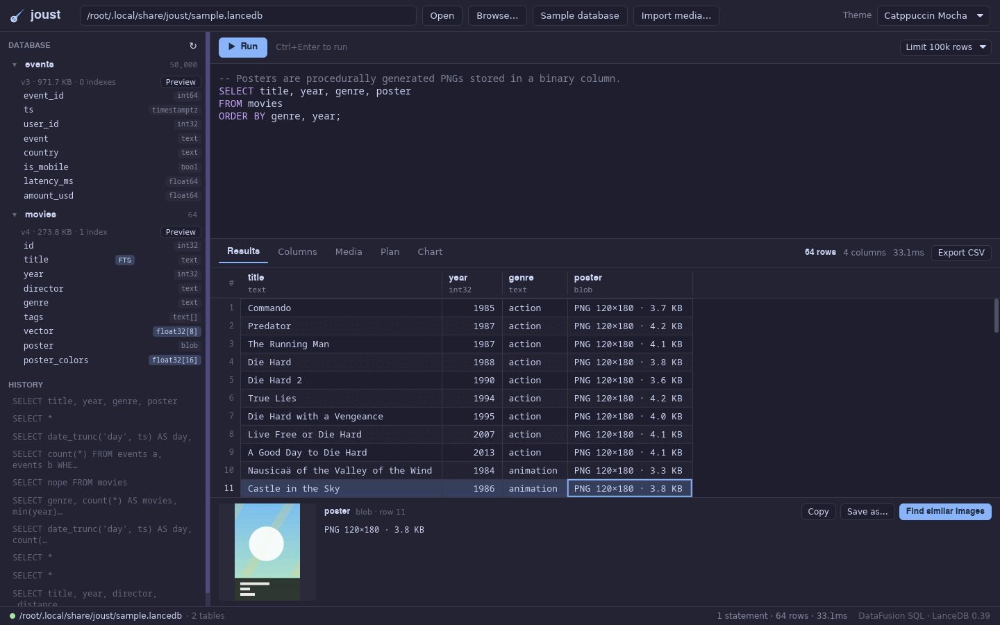 |

## Building

Requirements:

- Rust 1.91 or newer.
- `protoc` (the Protocol Buffers compiler), needed by Lance's build scripts:
  `apt install protobuf-compiler`, `brew install protobuf`, or
  `choco install protoc`.
- Optional: `ffmpeg` at runtime for video frames (`apt install ffmpeg`,
  `brew install ffmpeg`, `choco install ffmpeg`).
- On Linux, the usual runtime libraries for iced/winit: `libxkbcommon` plus
  `libxkbcommon-x11` on X11 (desktop installs have them; minimal containers may
  not), a working `xdg-desktop-portal` for the Browse…, Import media…, Save
  as… and Export CSV dialogs, and `xdg-open` for **Open**.

```sh
git clone git@github.com:justinrmiller/joust.git
cd joust
cargo run --release                      # start empty
cargo run --release -- ~/data/my.lancedb # open a database on start-up
```

Use `--release`: DataFusion and Lance are dramatically slower in debug builds.
The first build compiles several hundred crates and takes a while.

> **Note:** joust enables LanceDB's `remote` feature only because
> `lancedb` 0.39.0 does not compile without it. Only local (directory / object
> store URI) databases have been exercised.

## Using it

1. Click **Sample database** (or type a path and press Enter / **Open**, or
   **Browse…**).
2. Pick one of the example queries, or write your own and press `Ctrl+Enter`.
3. Switch between **Results**, **Columns**, **Media** (when the result has
   images), **Plan** and **Chart** tabs.
4. **Import media…** turns a folder of your own images, audio, video or PDFs
   into a table.

Some queries to try against the sample database:

```sql
-- Nearest neighbours in the synthetic embedding space
SELECT title, year, director, _distance
FROM vector_search('movies', 'vector', '[0.75, 0.1, 0, 0, 0, 0.55, 0, 0.35]', 8, 'cosine')
ORDER BY _distance;

-- Full-text search (the sample creates the FTS index)
SELECT id, title, year, _score
FROM fts('movies', '{"match": {"column": "title", "terms": "die hard"}}')
ORDER BY _score DESC;

-- Daily activity — open the Chart tab afterwards
SELECT date_trunc('day', ts) AS day, count(*) AS events, round(sum(amount_usd), 2) AS revenue_usd
FROM events GROUP BY 1 ORDER BY 1;

-- Media functions on the poster images (open the Media tab to browse them)
SELECT title, media_type(poster) AS mime, image_width(poster) AS w,
       image_height(poster) AS h, byte_length(poster) AS bytes
FROM movies ORDER BY bytes DESC LIMIT 10;

-- Video metadata (the trailers table needs ffmpeg at sample-creation time)
SELECT title, clip, media_duration(clip) AS seconds, media_codec(clip) AS codec,
       media_width(clip) AS w, media_height(clip) AS h
FROM trailers ORDER BY genre;

-- Persist a query result as a new Lance table
CREATE TABLE miyazaki AS
SELECT title, year FROM movies WHERE director = 'Hayao Miyazaki';
```

Identifiers follow SQL rules: unquoted names are lower-cased, so a table
called `MyTable` must be written `"MyTable"` (the sidebar inserts quoted names
for you).

## Keyboard shortcuts

| Keys | Action |
|---|---|
| `Ctrl+Enter` / `F5` | Run the editor (or the selection) |
| `Esc` | Cancel the running query (also works while typing in the editor) |
| Arrow keys, `PageUp`/`PageDown`, `Home`/`End` | Move the grid selection (after clicking the grid) |
| `Ctrl+Home` / `Ctrl+End` | First / last row |
| `Ctrl+C` (grid focused) | Copy the selected value |
| `Shift`+scroll | Scroll the grid horizontally |
| `Ctrl`+scroll (plan) | Zoom the plan diagram |

On macOS use `Cmd` instead of `Ctrl`.

## Development

```sh
cargo fmt --check
cargo clippy --all-targets -- -D warnings
cargo test
make coverage   # needs cargo-llvm-cov (cargo install cargo-llvm-cov)
```

The suite (127 tests) runs headless: no display or GPU is needed.

- **SQL layer, end to end** against a sample database built in a temporary
  directory: catalog sync, instrumented plans, `vector_search` (every
  argument form and error), `fts`, CTAS variants / `INSERT` / `DROP` / views,
  row limits, indexes, media functions, folder import and colour search.
- **App logic**: `App::update` is driven like the iced runtime would, running
  each returned `Task` and feeding its messages back, so opening databases,
  running / superseding / cancelling queries, sorting, charts, previews,
  "find similar", imports and flip-book playback are tested as user flows.
  Tests use in-memory settings and never touch your settings file; actions
  that open native dialogs or an external player are checked only up to the
  point where they would.
- **Views**: `iced_test` renders the whole window (all tabs, banners, the
  inspector, gallery and running states) in every theme and clicks through
  it; the grid, chart and plan canvases get simulated mouse and keyboard
  input (scrolling, zooming, dragging, resizing, hovering).
- **Parsers and helpers**: media sniffing, MP4 / Matroska / WAV parsing from
  synthetic bytes, thumbnails, profiles, the highlighter, chart scales and
  theme contrast (syntax colours must reach 3:1 against their background).

Tests that need ffmpeg generate their clips with it and skip (with a
message) when it isn't installed; `JOUST_FFMPEG=/nonexistent cargo test`
exercises the no-ffmpeg paths.

`make coverage` reports line coverage of production code only:
`scripts/coverage.py` drops `#[cfg(test)]` modules and test-only files, which
`cargo llvm-cov` would otherwise count as covered. It is currently about 97%;
what remains is mostly `main()` and the calls into native file dialogs,
`xdg-open` and ffmpeg timeouts.

### Layout

| Path | What |
|---|---|
| `src/db/mod.rs` | Connection, catalog sync, SQL execution, CTAS/DROP interception, indexing |
| `src/db/functions.rs` | `vector_search` and `fts` SQL table functions |
| `src/db/media_udf.rs` | `media_type`, `image_width/height`, `byte_length`, `media_width/height/duration/codec` |
| `src/db/import.rs` | Media folder import |
| `src/db/plan.rs` | Snapshot of the executed physical plan with metrics |
| `src/db/sample.rs` | Sample database generator |
| `src/app.rs` | Application state, messages and update loop |
| `src/ui/` | Views: layout, grid, media gallery, plan diagram, charts, column cards |
| `src/media.rs` | Media sniffing, image metadata, thumbnails, colour vectors |
| `src/av.rs` | Audio/video container parsing (MP4/MOV, WebM/Matroska, WAV) |
| `src/ffmpeg.rs` | Optional ffmpeg integration: poster frames, filmstrips, sample clips |
| `src/theme.rs` | Theme catalog and widget styles |
| `src/highlight.rs` | SQL syntax highlighter |
| `src/profile.rs` | Column profiling |
| `src/results.rs` | Result formatting, sorting, CSV export |
